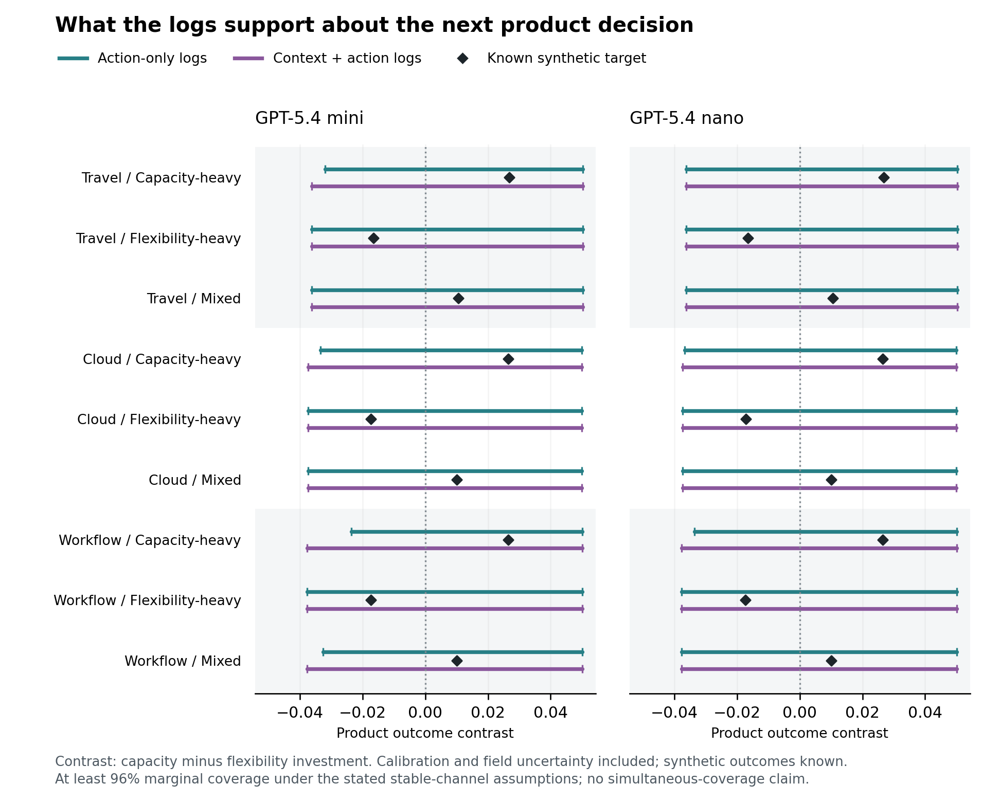
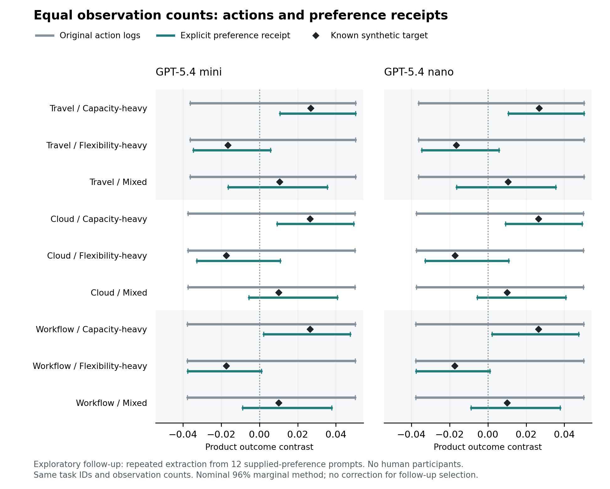

# The Delegation Blind Spot

**Learning What People Want When Agents Make the Choices**

Shivam Gupta | Research artifact 0.2.0 | Technical preprint, not peer reviewed

A successful delegated choice can leave a company unable to distinguish customers who would benefit from different future product changes. This repository studies that distinction through decision-specific channel bounds, feasible witness populations, formal proofs, and reproducible experiments. The underlying identification and inference tools have established antecedents; a new name is not a claim of a new general estimator.

[Read the technical preprint](output/pdf/delegation-blind-spot-paper.pdf) · [LaTeX source](paper/main.tex) · [Proof appendix](paper/theory-appendix.tex) · [Research status](docs/research-status.md) · [Publication review](docs/publication-review.md)

## Evidence in this version

The primary computational study made **4,800 real API attempts** across two pinned model snapshots, using the same 2,400 constructed tasks per model. Preferences, customer mixtures, and outcome utilities are synthetic. **There are zero human participants and no real-customer validation.**

| Primary result | GPT-5.4 mini | GPT-5.4 nano |
| --- | ---: | ---: |
| Requested snapshot | `gpt-5.4-mini-2026-03-17` | `gpt-5.4-nano-2026-03-17` |
| API attempts | 2,400 | 2,400 |
| Valid choices | 2,391 | 2,392 |
| Retained transport failures | 9 | 8 |
| Field tasks, excluding calibration | 1,440 | 1,440 |
| Utility-maximizing field choices | 73.19% | 55.69% |
| Mean synthetic field regret | 0.01863 | 0.05728 |
| Conservative decisions resolved | 0 / 18 | 0 / 18 |

[Recorded summary and execution accounting](results/model-study-summary/summary.json) are the numerical source. Failures stay in the analysis, with no replacement retries. Field performance includes failures in its denominator and assigns them zero delivered utility. These are generator-specific comparisons, not a general model ranking.

**All 36 primary decision intervals remain unresolved.** This is an informative limitation of the conservative diagnostic at the tested measurement budget, not evidence that it successfully chooses product investments. Zero wrong certified decisions here is achieved by abstaining on every condition. The intervals include channel and field uncertainty, with at least 96% marginal coverage only under the stated stable-channel and sampling assumptions. This is neither a simultaneous guarantee nor an empirical estimate of coverage. The observed result does not isolate intrinsic nonidentification from finite-sample uncertainty.



The study also includes constrained label-shift point estimates, a fixed-calibration bootstrap, algorithmic controls, synthetic outcome uncertainty, and an explicitly exploratory cross-model transport analysis. Three domain framings share one mathematical generator; they are not three independent market validations.

The separately frozen **explicit-preference receipt follow-up** completed another **2,400 real model requests**, all successful. Across both stages there are **7,200 API attempts, 7,183 valid responses, and 17 retained failures**. The follow-up asks for the largest preference weight already supplied in the prompt: **12 distinct prompts** are repeatedly queried, with 1,200 requests per model. Both models report the supplied attribute correctly on all requests.

For each model, attribute-only receipt intervals resolve **3 of 9** selected domain/cohort conditions, compared with **0 of 9** for the same task subset using action-only logs. None of the three resolved conditions contradicts the known synthetic target; the other six remain unresolved. Mean interval width decreases from **0.087204** to **0.043597**. These are descriptive, paired comparisons from an exploratory follow-up chosen after the primary result, not a significance test or a post-selection coverage guarantee. Equal observation counts do not equalize API costs, preference-elicitation burden, or privacy exposure.



See the [recorded receipt summary](results/receipt-study-summary/summary.json) and [frozen receipt plan](experiments/v2/frozen-receipt-plan.json). The result supports explicitly measuring relevant information in this constructed task. It does not establish general preference understanding, a need for an LLM extractor, discovery of unknown customer preferences, or human validation.

## Install and test

Python 3.9 or later:

```sh
python3 -m pip install -r requirements.txt
python3 -m pip install --no-deps -e .
python3 -m unittest discover -s tests -v
node study/test-instrument.cjs
```

The Node command tests the offline preview's reference rule and export safeguards. Python tests cover the estimators, identification bounds, certificates, experiment schema, and numerical boundary cases. They do not establish customer validity or replace independent technical review.

## Reproduce recorded model results without API calls

Compressed raw records are accompanied by [archive checksums](results/model-artifacts.json). Unpacking verifies both compressed and uncompressed hashes and refuses to replace differing local files.

```sh
python3 scripts/unpack_model_artifacts.py
python3 scripts/reproduce_model_results.py --require-receipts
```

The second command reruns both primary analyses and both receipt comparisons in temporary directories and compares their JSON numerical results with the stored analyses. `--require-receipts` fails rather than silently skipping a missing follow-up. New model calls are unnecessary. Remote model responses cannot be regenerated bit for bit from a task-generator seed.

To regenerate primary figures in a new directory:

```sh
python3 experiments/v2/plot_results.py \
  --mini results/model-study-mini --nano results/model-study-nano \
  --output results/reproduced-primary-figures \
  --pricing experiments/v2/pricing.json
```

The plotting command refuses an existing output directory. Reported token costs are estimates, not account invoices; transport failures can have missing billable usage.

After unpacking the recorded artifacts, reproduce each paired receipt/action comparison into a new file:

```sh
python3 experiments/v2/analyze_receipts.py \
  --prepared results/receipt-study-mini --source results/model-study-mini \
  --output results/reproduced-receipt-mini.json
python3 experiments/v2/analyze_receipts.py \
  --prepared results/receipt-study-nano --source results/model-study-nano \
  --output results/reproduced-receipt-nano.json
```

The analyzer requires one final result per frozen task and compares the same selected IDs and budgets. It does not substitute uncollected requests or count repeated prompts as independent people.

Regenerate the exploratory receipt figure and execution summary in a new directory:

```sh
python3 experiments/v2/plot_receipts.py \
  --mini results/receipt-study-mini --nano results/receipt-study-nano \
  --output results/reproduced-receipt-figures \
  --pricing experiments/v2/pricing.json
```

## Prepare and execute a new model run

Preparation is offline. These settings reproduce the primary task design with new output directories:

```sh
python3 experiments/v2/prepare.py --output results/new-mini \
  --model gpt-5.4-mini-2026-03-17 --seed 73912 \
  --calibration-per-class 80 --field-size 160 --outcome-audits 2048
python3 experiments/v2/prepare.py --output results/new-nano \
  --model gpt-5.4-nano-2026-03-17 --seed 73912 \
  --calibration-per-class 80 --field-size 160 --outcome-audits 2048
```

**The following command makes paid API calls.** Configure `OPENAI_API_KEY` securely in the environment, check model access and current prices, and inspect the frozen requests first. No credential belongs in this repository.

```sh
python3 experiments/v2/run_live.py \
  --directories results/new-mini results/new-nano \
  --max-total-requests 4800 --workers 8 --requests-per-second 8
```

The runner retains attempt events, final responses, failures, returned model IDs, token usage, and execution hashes. It refuses to overwrite responses and does not retry automatically. Analyze one resulting run with the system filter, which selects final model records rather than attempt events:

```sh
python3 experiments/v2/analyze.py --prepared results/new-mini \
  --responses results/new-mini/responses.jsonl \
  --system gpt-5.4-mini-2026-03-17 --output results/new-mini/analysis.json
```

Use the corresponding nano snapshot and directory for the second analysis. Prepare a new receipt run with `python3 experiments/v2/prepare_receipts.py --source results/new-mini --output results/new-receipt-mini`; execution uses the same `run_live.py` runner. See [experiment instructions](experiments/v2/README.md) and the [frozen primary plan](experiments/v2/frozen-study-plan.json). The plan was frozen before main execution but was not externally preregistered.

## Build the paper

The current paper uses a conventional two-column LaTeX technical-preprint format. It does not claim compliance with a selected venue's template or acceptance requirements. With Tectonic installed:

```sh
python3 paper/build_results.py
make paper
```

The output is `output/pdf/delegation-blind-spot-paper.pdf`. Numerical prose and tables are generated from recorded analyses. The older [research note](output/pdf/delegation-blind-spot-research-note.pdf) is retained as a historical 0.1 artifact and does not describe the current experimental status. Its separate renderer is `paper/render_note.py`, with dependencies in `requirements-paper.txt`.

## Earlier synthetic audit pilot

```sh
python3 experiments/run_pilot.py --config experiments/pilot-v1.json \
  --output results/new-pilot-reproduction
python3 experiments/plot_pilot.py --results results/new-pilot-reproduction
python3 experiments/diagnose_channel.py
```

The pilot contains 100,000 synthetic estimator evaluations, not model calls or people. [Reproduction hashes](results/reproducibility.json) document two byte-identical numerical runs. Compressed per-replicate data are in `results/pilot-v1/replicates.csv.gz`. Its active and robust audit methods are attributed baselines, not a claimed new estimator.

## Investigator-only human-study preparation

Open [study/index.html](study/index.html) locally for a five-step offline preview. It includes preference elicitation, random assignment to an unaided or explicitly rule-based reference aid, separate outcome questions, and local JSON export. The aid is not live AI. Preview records are permanently labeled as instrument tests, not human evidence.

[Study instructions](study/README.md), a consent drafting scaffold, and [browser QA](study/qa-report.md) are included. No recruitment or participant collection has taken place. Consent, ethics determination, actual recruitment, appropriate model provenance, and a reviewed study protocol remain necessary before genuine human validation.

## Scope and research integrity

The proofs specialize established identification, optimal-recovery, and decision-theory tools. The outcome contrast, latent taxonomy, observation schema, and calibration stability are substantive assumptions. Model explanations and explicit preference receipts are measurement channels, not privileged access to a customer's true preferences. Ordinary randomized experiments remain valid for outcomes that are actually measured under their assumptions.

See [theory review](docs/theory-review.md), [statistical review](docs/statistical-review.md), [empirical review](docs/empirical-review.md), and [literature ledger](docs/literature.md). A polished artifact is not a substitute for an original contribution, independent review, or real customer evidence. AI-assisted development and research provenance must be reported honestly under the chosen venue's rules.
