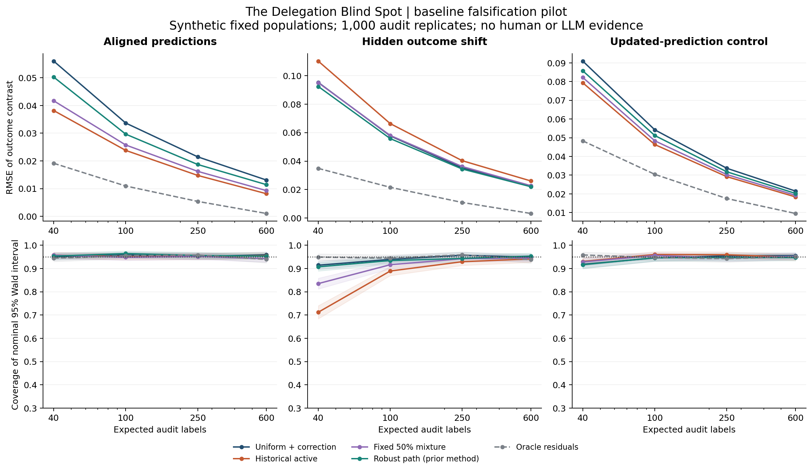

# The Delegation Blind Spot

**Research in progress. Author: Shivam Gupta.**

Working question: how can a product learn customer outcomes when its observable interactions are produced by agents?

**Central distinction:** successful delegation and useful evidence about the customer's next need are different outcomes. This can happen with human choices too; the role of agents must be tested, not assumed.

Read the [seven-page research note](output/pdf/delegation-blind-spot-research-note.pdf), its [editable source](paper/research-note.md), or the [decision-specific channel diagnostic](docs/channel-diagnostic.md). The note contains two formal arguments, a worked example, exploratory results, primary references, limitations, and an evaluation plan. It is not a submission-ready or peer-reviewed paper.

This repository starts with a falsification pilot, not a finished paper or a claim of a new estimator. It implements established audit-corrected estimators and active sampling baselines, then examines shifts in the relationship between visible telemetry and unobserved outcomes. The initial data are entirely synthetic. No language model or human participant results are included.

## Reproduce the pilot

Python 3.9 or later, with the versions in `requirements.txt`:

```sh
python3 -m pip install -r requirements.txt
python3 -m unittest discover -s tests -v
python3 experiments/run_pilot.py --config experiments/pilot-v1.json --output results/my-reproduction
python3 experiments/plot_pilot.py --results results/my-reproduction
```

The default results already exist in this repository. To rerun without overwriting them:

```sh
python3 experiments/run_pilot.py --config experiments/pilot-v1.json --output results/new-reproduction
python3 experiments/diagnose_channel.py
```

See `experiments/run_pilot.py --help` for runner options. [Reproduction hashes](results/reproducibility.json) document two byte-identical numerical runs. All 100,000 per-replicate records are included as `results/pilot-v1/replicates.csv.gz`; unzip before numerical comparisons. Manifest timestamps are intentionally excluded from the equality check.



At 100 expected labels in the constructed strong-shift scenario, nominal 95% Wald coverage is 88.9% for historical active sampling, 93.9% for uniform sampling, and 93.4% for the robust-path adaptation. These numbers are specific to this simulation. They do not establish a new method or an effect in human behavior.

## Constructed agent instrument

```sh
python3 experiments/run_agent_calibration.py --output results/new-controls --model control-only --controls
python3 experiments/run_agent_calibration.py --output results/prepared --model YOUR_EXACT_MODEL_ID
```

The second command prepares 216 requests without contacting an API. Add `--execute` only when `OPENAI_API_KEY` is securely loaded and model selection and cost are settled. Use `--max-calls` and `--max-output-tokens` to bound requests. The runner does not retry failures automatically, and it never overwrites a run. It records usage but does not infer dollar prices. API calls have not been run in this release. The 648 stored control decisions are not language-model results. These tasks test the measurement instrument; they cannot establish market behavior.

## Build the research note

Install `requirements-paper.txt`, then run `python3 paper/render_note.py`. The PDF has searchable text and clickable references. Its seven rendered pages have been visually inspected.

The runner records configuration and source hashes, software versions, seeds, per-replicate estimates, realized audit costs, and summary metrics. A regeneration must match the timing-free numerical outputs. The exact expected audit budget is matched across implementable sampling policies; independent Bernoulli selection means realized cost varies and is reported.

## What is and is not measured

- Target: the difference between two **fixed synthetic population** outcome means. It is not a population causal treatment effect estimate from a real randomized trial.
- Audit estimator: a prediction-plus-inverse-probability residual correction. This is established survey-sampling and prediction-powered inference machinery.
- Baselines: uniform, historical-error active sampling, a fixed mixture, and a robust linear-path policy adapted from Li, Zrnic, and Candes (2025). An oracle policy uses otherwise unavailable outcome residuals and is labeled as such.
- Intervals: an ordinary design-based Wald approximation and a conservative finite-population Bernstein bound. The former is not guaranteed at tiny audit budgets. The latter depends on independent sampling and bounded outcomes.
- Test setting: observable data can be identical in two worlds with different outcomes. This is constructed, not evidence that a deployed product exhibits that phenomenon.
- Intended next work: full novelty subtraction; a distinct method if warranted; realistic delegated-task environments; real model experiments; a consented human study; proofs, manuscript, and reproducible publication artifacts.

See `docs/problem.md`, `docs/literature.md`, and `docs/research-status.md`. Numerical pilot success cannot establish originality or justify a claim about customer behavior.
